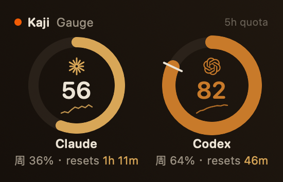
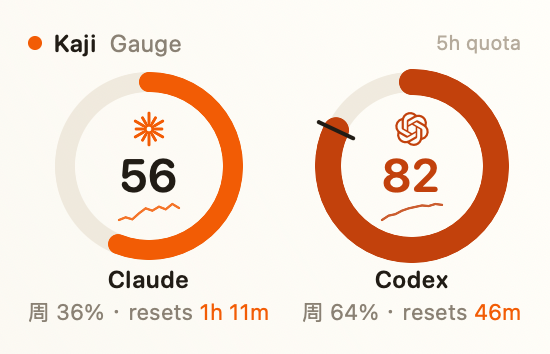

# Kaji Gauge

Your AI-provider quota, at a glance. A small native macOS app that reads
coding-agent usage and draws it as warm ring gauges — in the menu bar and in a
floating panel you can leave on the desktop.

| Kaji Ember (dark) | Kaji Sun (light) |
|:---:|:---:|
|  |  |

Two surfaces, same rings:

- **Menu bar** — a compact indicator showing the most-constrained provider
  (a tiny ring + `NN%`). Click it for a popover with the full gauges.
- **Floating panel** — an always-on-top, draggable HUD with the same gauges.
  Toggle it from the menu-bar item's right-click menu. Shown/hidden state is
  remembered.

Warm and restrained, with **Auto light/dark**: **Kaji Ember** (dark) and
**Kaji Sun** (light) follow the system appearance.

Currently surfaced: **Claude** and **Codex**. Other providers are hidden for now
(see `Providers.visible`).

## The ring

One ring per provider, the 5-hour window:

- A track circle, a value arc trimmed to the used fraction, starting at 12
  o'clock.
- **Gold** normally. At **≥ 80%** it deepens to a same-family **amber**,
  thickens, and grows an alert tick at the arc head — so "near the limit" reads
  even without color. No neon orange, no glow — restrained and warm.
- Center: the real provider logo (tinted to the ring color) — Claude's radial
  burst, the OpenAI knot — the big used-% number, and a thin sparkline.
- Below: the provider name + `周 {week}% · resets {countdown}`.

The sparkline has no real history source — `quota.py` doesn't expose a 24h
series. Kaji Gauge keeps a rolling buffer of the sampled 5h used-% values
(persisted in `UserDefaults`) and only draws it once there's genuine movement;
a flat line is worse than none, so early on there's simply no sparkline.

There is no "updated Ns ago" label — the gauge polls on its own (every 30s);
the only status it surfaces is a small `stale` flag if a fetch fails.

## Build & run

Requires the Xcode command-line tools (Swift 5.9+), Apple Silicon, macOS 13+.

```sh
# Dev — runs as a menu-bar agent (no dock icon):
swift run

# Release app bundle (dist/KajiGauge.app, LSUIElement):
./scripts/build-app.sh
open dist/KajiGauge.app
```

## Data source

Kaji Gauge shells out to the `helm-quota` script every 30s and parses its JSON:

```sh
python3 .../helm-terminal/tools/helm-quota/quota.py --json
```

It reads, per provider, the `limits` block: `five_hour_used_percent`,
`seven_day_used_percent`, reset timestamps, plan, plus `tokens_today`. Providers
with no `limits` (nothing to gauge) are skipped. Missing fields render `—`; a
script error keeps the last good data and shows a stale marker — it never
crashes.

### Pointing it elsewhere

The default path is a constant at the top of `Sources/KajiGauge/QuotaStore.swift`
(`Config.defaultQuotaScriptPath`). Override it at runtime without rebuilding:

```sh
defaults write dev.kaji.gauge quotaScriptPath /path/to/quota.py
```

## Roadmap

- WidgetKit desktop widget
- Configurable providers / marks from a settings UI
- Real 24h sparkline (needs `quota.py` to log a rolling history)
- Login-item autostart

## License

TBD.
