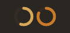

# Kaji Gauge

Your AI-provider quota, at a glance — warm ring gauges for **Claude** and
**Codex**, in your menu bar and on your desktop.

<p align="center">
  
  &nbsp;&nbsp;
  
</p>

## Install

```sh
curl -fsSL https://raw.githubusercontent.com/interesting-vibe-coding/kaji-gauge/main/install.sh | bash
```

Drops the app in `/Applications` and launches it — the rings appear in your menu
bar. macOS 13+, Apple Silicon. Needs `python3` (ships with the Xcode tools) to
read your usage. Unsigned for now, so the installer clears the Gatekeeper
quarantine for you.

## What it shows

<p align="center">
  
</p>

- **Menu bar** — one tiny ring per provider, quiet and glanceable.
- **Click** the rings for the full popover; from there, float a draggable panel
  anywhere on your desktop (and hide it again).
- Each ring is the **5-hour usage window**: gold normally, deeper amber past
  80%. Center shows the live used-%; below it, the weekly % and the reset
  countdown.
- **Auto light/dark** — *Kaji Sun* by day, *Kaji Ember* by night.

Everything is read locally from your own Claude Code / Codex files by a bundled,
dependency-free Python reader. Nothing leaves your machine.

## Build from source

```sh
swift run                 # dev — menu-bar agent, no dock icon
./scripts/build-app.sh    # release bundle → dist/KajiGauge.app
```

## License

MIT — see [LICENSE](LICENSE).
