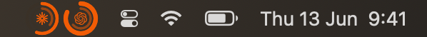

# Kaji Gauge

Your AI-provider quota, at a glance — warm ring gauges for **Claude** and
**Codex**, in your menu bar and on your desktop.

<p align="center">
  <a href="https://github.com/interesting-vibe-coding/kaji-gauge/releases/latest"></a>
  
  
  <a href="LICENSE"></a>
</p>

<p align="center">
  
  &nbsp;&nbsp;
  
</p>

## Install

```sh
curl -fsSL https://raw.githubusercontent.com/interesting-vibe-coding/kaji-gauge/main/install.sh | bash
```

Drops the app in `/Applications` and launches it — the rings appear in your menu
bar. macOS 13+, Apple Silicon. Needs `python3` (ships with the Xcode tools) to
read your usage. Unsigned for now, so the installer clears the Gatekeeper
quarantine for you.

## What it shows

<p align="center">
  
  &nbsp;&nbsp;&nbsp;
  
</p>

- **Menu bar** — one concentric **double ring** per provider: the **outer** arc
  is your 5-hour window, the **inner** arc your 7-day window. In the center sits
  the provider's own mark — the Claude burst, the Codex knot — so you can tell
  them apart at a glance.
- **Two looks, your choice** (Settings → *Menu bar*): **Mono** (default) draws
  the rings in the adaptive label color, so they sit quietly among the native
  monochrome menu-bar icons; **Color** draws the arcs in Kaji persimmon on a
  neutral track, for more presence. Left pair above is Mono, right is Color.
- **Click** the rings for the full popover — both reset countdowns (5h and 7d),
  a draggable desktop panel you can float anywhere, per-provider show/hide, the
  menu-bar style switch, and an **EN / 中文** toggle. Right-click the icon for
  the same options.
- **Auto light/dark** — *Kaji Sun* by day, *Kaji Ember* by night.

Everything is read locally from your own Claude Code / Codex files by a bundled,
dependency-free Python reader. Nothing leaves your machine.

## Build from source

```sh
swift run                 # dev — menu-bar agent, no dock icon
./scripts/build-app.sh    # release bundle → dist/KajiGauge.app
```

## Part of Kaji

Kaji Gauge is the menu-bar companion to **[Kaji](https://github.com/interesting-vibe-coding/kaji)** —
a macOS-native terminal built for AI-assisted work (the rings, the warm palette,
and the 舵 helm mark all come from there). There's also a small
[landing page](https://interesting-vibe-coding.github.io/kaji-gauge-site/).

## License

MIT — see [LICENSE](LICENSE).
