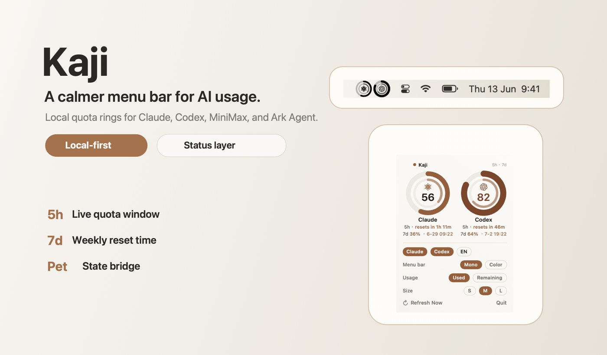

<div align="center">

# Kaji

**漂亮的 macOS 菜单栏 AI 编程用量状态栏。**

本地读取 Claude、Codex、MiniMax、Ark Agent 的额度，用一组安静的状态环放进菜单栏。

Kaji 会在长任务撞上额度墙之前提醒你。它本地优先、原生、轻，适合一直待在菜单栏里。

[English](README.md)

<a href="https://github.com/interesting-vibe-coding/kaji/releases/latest"></a>
<a href="https://github.com/interesting-vibe-coding/kaji/actions/workflows/ci.yml"></a>
<a href="https://github.com/interesting-vibe-coding/kaji/stargazers"></a>

<a href="LICENSE"></a>

<br>
<br>

<p align="center"></p>

</div>

## 安装

```sh
curl -fsSL https://raw.githubusercontent.com/interesting-vibe-coding/kaji/main/install.sh | bash
```

需要 macOS 13+ 和 Apple Silicon。安装脚本会下载最新 release，移动到
`/Applications`，停止旧进程，然后启动菜单栏应用。

> Kaji 目前还没有签名。安装脚本会透明地清除 Gatekeeper 隔离标记；等签名和公证完成后，这一步会去掉。

## 为什么做

Coding agent 很有用，但额度会在长任务中途突然耗尽。Kaji 把额度窗口变成菜单栏里的安静信号：看一眼，继续工作。

## 它显示什么

- **菜单栏状态环**：用紧凑的双环显示你选择的 provider。
- **额度弹窗**：5 小时用量、7 天用量、本地重置时间、provider 显隐、S/M/L 尺寸、已用/剩余模式、中英文。
- **安静的原生界面**：没有 dashboard，没有 Dock 图标，没有浮窗。
- **明暗主题**：温暖的原生视觉，菜单栏支持 mono / color 模式。
- **更新提示**：发现新的 GitHub Release 时，菜单栏图标显示一个小圆点。
- **桌宠桥接**：输出本地 `pet-state.json`，给桌宠 runtime 消费。见 [docs/pet-bridge.md](docs/pet-bridge.md)。

## 支持的 Provider

| Provider | Kaji 读取什么 |
| --- | --- |
| Claude | 本地 Claude Code 额度窗口 |
| Codex | 本地 Codex 用量窗口 |
| MiniMax | 通过本地 `mmx` CLI 读取 Token Plan 用量 |
| Ark Agent | 配置本地凭据后读取 Volcengine Ark Agent Plan 用量 |

## 工作方式

```text
本地 CLI / 账号数据 -> 内置 quota.py reader -> SwiftUI 菜单栏 + 弹窗
```

- **本地 reader**：内置 Python 脚本读取本地额度和账号窗口。
- **原生界面**：SwiftUI 渲染菜单栏状态环和弹窗。
- **很窄的联网范围**：GitHub Releases 用于检查更新；只有配置 Ark Agent 凭据时才访问 Volcengine / Ark。

数据不上传。

## 桌宠桥接

Kaji 会写出一个本地状态文件：

```text
~/Library/Application Support/Kaji/pet-state.json
```

桌宠 runtime 可以把它映射到 `idle`、`running`、`review`、`waiting`、`failed`
动画。Kaji 只做 quota/status 层；`hatch-pet` 只做 pet 资产编译器。

## 源码构建

```sh
swift run                 # 开发用菜单栏应用
./scripts/build-app.sh    # release 包 -> dist/Kaji.app
```

如果 CLT-only 机器上 SwiftPM 链接失败，用：

```sh
./scripts/build-local.sh  # 直接 swiftc 构建，并安装到 /Applications
```

## FAQ

**为什么 macOS 会提示 Kaji 未签名？**

Kaji 还没有签名和公证。安装脚本会清除 quarantine 标记，并明确告诉你发生了什么。

**Ark Agent 配置放在哪里？**

使用 `~/.config/kaji/volcengine.env`。旧的 `~/.config/kaji-gauge/volcengine.env` 仍作为 fallback 生效。

**Kaji 能替代 provider 账单面板吗？**

不能。Kaji 是本地状态镜像，不是账单真相源。

## 限制

Provider API 和本地文件格式都可能变化。当 Kaji 暂时拿不到可用窗口时，对应 provider 会显示为空或未知。

## License

MIT - 见 [LICENSE](LICENSE)。
