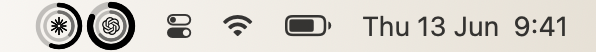

<div align="center">

# Kaji

**漂亮的 macOS 菜单栏 AI 用量状态栏。**

本地读取 Claude、Codex、MiniMax、Ark Agent 的额度，用一组安静的状态环放进菜单栏。

[English](README.md)

<a href="https://github.com/interesting-vibe-coding/kaji-gauge/releases/latest"></a>

<a href="LICENSE"></a>

<br>
<br>



<br>
<br>


</div>

## 安装

```sh
curl -fsSL https://raw.githubusercontent.com/interesting-vibe-coding/kaji-gauge/main/install.sh | bash
```

需要 macOS 13+ 和 Apple Silicon。安装脚本会下载最新 release，移动到
`/Applications`，然后启动菜单栏应用。

> Kaji 目前还没有签名。安装脚本会透明地清除 Gatekeeper 隔离标记；等签名和公证完成后，这一步会去掉。

## 它显示什么

- **菜单栏状态环**：用紧凑的双环显示你选择的 provider。
- **额度弹窗**：5 小时用量、7 天用量、本地重置时间、provider 显隐、S/M/L 尺寸、已用/剩余模式、中英文。
- **Provider 覆盖**：Claude、Codex、MiniMax、Ark Agent。
- **安静的视觉**：原生菜单栏交互，自动明暗主题，支持 mono / color 模式。
- **更新提示**：发现新的 GitHub Release 时，菜单栏图标显示一个小圆点。

## 工作方式

```text
本地 CLI / 账号数据 -> 内置 quota.py reader -> SwiftUI 菜单栏 + 弹窗
```

Kaji 通过内置 Python reader 读取本地额度和账号窗口，再交给原生 SwiftUI 菜单栏界面展示。数据不上传。

网络请求刻意保持很窄：

- GitHub Releases：用于检查更新。
- Volcengine / Ark：仅在配置了 Ark Agent 凭据时读取对应额度。

## 源码构建

```sh
swift run                 # 开发用菜单栏应用
./scripts/build-app.sh    # release 包 -> dist/KajiGauge.app
```

如果 CLT-only 机器上 SwiftPM 链接失败，用：

```sh
./scripts/build-local.sh  # 直接 swiftc 构建，并安装到 /Applications
```

## 限制

Kaji 是本地状态工具，不是账单真相源。Provider API 和本地文件格式都可能变化；当 reader 暂时拿不到可用窗口时，对应数据会显示为空或未知。

## License

MIT - 见 [LICENSE](LICENSE)。
